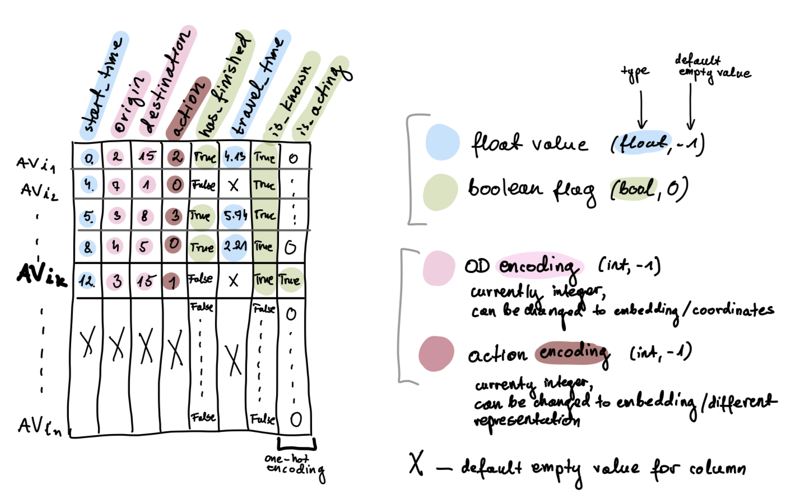
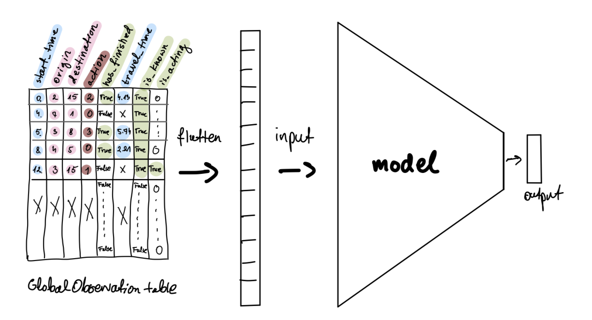

# Centralized DQN with GlobalObservation

The centralized DQN approach for the AV routing task is built on two core components: a `DQN agent` (cDQN) and a `GlobalObservation` structure.

**GlobalObservation** maintains a centralized representation of the CAV fleet state, including agents origin, destination, departure time, selected route, and travel duration (for completed trips). It serves as the primary data source for the cDQN.

**Centralized DQN agent** (cDQN) acts as a fleet-level decision-maker with continuous access to the global fleet state. For each departing CAV agent, it selects a route based on a snapshot of the `GlobalObservation` at the CAV agent’s departure time.

## Technical details

### GlobalObservation

The core data structure in the `GlobalObservation` class is a table of shape `num_agents` × `num_features`, where rows correspond to CAV fleet agents and columns represent observed features, such as origin, destination, departure time, selected route, CAV travel time (if the trip is completed), and boolean status indicators (like: is driving, finished, known).

 

<figure>
  
  <figcaption>GlobalObservation table schema.</figcaption>
</figure>

  

For each agent, a per-agent observation is constructed as a snapshot of this table at the agent’s departure time. An additional one-hot column identifying the currently starting agent is added, resulting in a table of shape `num_agents × (num_features + 1)`, which is then flattened and used as input to the cDQN.

 

<figure>
  
  <figcaption>GlobalObservation table as model input.</figcaption>
</figure>

  

The table is initialized with empty values at the start of the experiment and incrementally populated as agents depart.

Future extensions may define alternative observation views (e.g., restricted to agents within a certain time window from the current agent). Also more clolumn-features can be added.

### cDQN agent
The cDQN is a reinforcement learning agent comprising a deep Q-network, replay buffer, exploration-exploitation policy, and training procedure.
The current implementation uses a single MLP-based Q-network (without a target network) and a FIFO replay buffer with uniform sampling. This simplified design maintains consistency with prior approaches (e.g. IQL). However, the architecture can be further developed in multiple directions (see: Extensions section).

## Key new features

Compared to previous approaches (IQL, IPPO, MAPPO, QMIX), this method introduces the following qualities:

- Utilizes **contextual information** from **all city areas traversed by CAVs**, instead of relying only on departure counts associated with the OD pairs.
This gives the model the ability to capture global traffic dynamics, in particular, to implicitly learn remote factors that influence congestion experienced by a given vehicle.

- The current cDQN experiments are based on a single-step decision setting, consistent with earlier MARL methods (IPPO, MAPPO, IQL, QMIX). However, the introduced `GlobalObservation` formulation enables future extensions **toward multi-step scenarios**, which were not feasible under previous observation designs. In such settings, a global agent could account for the temporal evolution of the system rather than making only a one-shot decisions at CAV departure time.

Note: from a practical perspective, the current `GlobalObservation` design does not require any additional traffic infrastructure compared to the prior observation types (OD-departure count). It relies only on basic information that can be registered and shared by CAV vehicles, which makes it feasible to consider in realistic setting.

## Further development

### Current limitations:

cDQN level:
- **Uniform replay buffer storage and sampling** - introduces a signal bias toward first agents ($k^i$ possible observations for $i$-th agent, where $k$ is number of possible routes per OD). This leads to an unequal learning signal across AV agents.
- Uniform exploration in a large state space (possible solution - introduce biased exploration(?) e.g. bias towards routes with lower free-flow time). This is a broader issue, not specific to cDQN itself.

Environment representation level:
- OD pairs are currently represented as integers, which has no spatial meaning (-> coordinate-based encoding can be considered),
- Route choices are represented as integers (meaningful representation: an open problem).

### Extensions / experiment ideas:

General:
- Multi-step scenarios: use GlobalObservation to extend beyond single-step decision making.

Architecture develompent:
- Attention over `GlobalObservation` table (identify most relevant agents for a starting agent).
- Observation embeddings (whole table / single features / row-wise / mixed) -> reduce input size, improve feature/action representation.
- Fixed upper-bound table size -> enable reuse across varying fleet sizes (compatible with embeddings).

Information modelling:
- Time-windowed observations (focus on agents within a certain time window from now).
- Include future planned trips.

Different architectures (sequential models):
- RNN/LSTM-based agent (e.g. table embedding as hidden state, current agent data as input).

